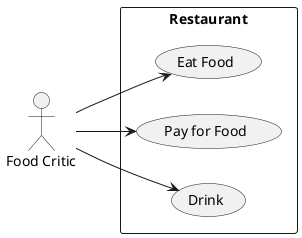

# Описание требований и архитектуры

## Введение
<!-- Общее краткое описание создаваемой системы -->
В рамках курса осуществляется проектирование решения на основе [постановки задачи от "заказчика"](task.md).

- [Описание требований и архитектуры](#описание-требований-и-архитектуры)
  - [Введение](#введение)
  - [Заинтересованные стороны](#заинтересованные-стороны)
  - [Бизнес-контекст (бизнес-требования)](#бизнес-контекст-бизнес-требования)
  - [Глоссарий](#глоссарий)
  - [Модель предметной области](#модель-предметной-области)
  - [Требования к системе](#требования-к-системе)
    - [Сценарии использования (Use case)](#сценарии-использования-use-case)
    - [Функциональные требования](#функциональные-требования)
    - [Нефункциональные требования/Требования к атрибутам качества](#нефункциональные-требованиятребования-к-атрибутам-качества)
    - [Ограничения](#ограничения)
  - [Архитектура](#архитектура)
    - [Журнал архитектурных решений](#журнал-архитектурных-решений)
    - [Контекст решения](#контекст-решения)
    - [Компонентная архитектура](#компонентная-архитектура)
    - [Реализация сценариев использования](#реализация-сценариев-использования)
    - [Программные интерфейсы](#программные-интерфейсы)
    - [Схема развертывания](#схема-развертывания)
  
## Заинтересованные стороны
<!-- Перечень заинтересованных сторон и их интересов по отношению к создаваемой системе. 
Подробнее: https://confluence.mts.ru/pages/viewpage.action?pageId=399975538 
-->
| Заинтересованная сторона | Интересы                                                                           |
|:-------------------------|:-----------------------------------------------------------------------------------|
| *Учредители*             | *Развитие бизнеса*                                                                 |
| *Акционеры*              | *Увеличение прибыли*                                                               |
| *Отдел маркетинга*       | *Пиар бренда компании*                                                             |
| *Отдел HR*               | *Формирование лояльности к компании*                                               |
| *Разработчики*           | *Опыт участия в высоконагруженном проекте; работа с современным стеком технологий* |
| *Эксплуатация*           | *Удобство поддержки; высокое качество продукта*                                    |
| *Докладчики*             | *Профессиональный рост; личный пиар; обмен опытом*                                 |
| *Участники конференции*  | *Получение знаний о современных тенденциях; общение с профессионалами*             |

## Бизнес-контекст (бизнес-требования)
<!-- Общее описание бизнес-контекста создаваемой системы (автоматизируемой деятельности), список бизнес-целей заинтересованных сторон 
Подробнее: https://confluence.mts.ru/pages/viewpage.action?pageId=399973845
-->
* Для повышения узнаваемости бренда и потенциального привлечения специалистов необходимо регулярно организовывать конференции.
* Частота проведения и темы конференций должны определяться исходя из потребностей в сотрудниках определённых специальностей.
* Чтобы увеличить охват участников необходимо обеспечить проведение конференции в формате онлайн.
* Для обеспечения максимальной гибкости компании необходима собственная платформа онлайн-конференций.

## Глоссарий
<!-- Содержит основные понятия и термины предметной области  
Подробнее: https://confluence.mts.ru/pages/viewpage.action?pageId=375782595
-->
| Понятие                        | Сокращение                         | Определение                                                       |
|:-------------------------------|:-----------------------------------|:------------------------------------------------------------------|
| *Доклад*                       |                                    | *Выступление на определённую тему*                                |
| *Докладчик*                    |                                    | *Пользователь, выступающий с докладом*                            |
| *Клиент*                       |                                    | *Пользователь системы онлайн-конференций, купивший платный билет* | 
| *Гость*                        |                                    | *Пользователь, пришедший посмотреть конференцию бесплатно*        |
| *Администратор*                |                                    | *Пользователь, ведущий и модерирующий конференцию*                |
| *Расписание конференции*       |                                    | *Расписание с темами выступлений докладчиков*                     |
| *Чат конференции*              |                                    | *Чат для общения участников конференции*                          |

## [Модель предметной области](data/data.md)

## Требования к системе

### Сценарии использования (Use case)
<!-- Подробное описание сценариев использования системы с привязкой к ролям участников и задействованным бизнес-сущностям 
https://confluence.mts.ru/pages/viewpage.action?pageId=375782108 
https://confluence.mts.ru/pages/viewpage.action?pageId=375782119 
-->
#### Диаграмма сценариев использования (Use Case Diagram) <!-- omit in toc -->

#### Список сценариев использования <!-- omit in toc -->

| ID     | Описание                                          |
|--------|---------------------------------------------------|
| UC.001 | *[Название сценария использования](uc/uc.001.md)* |

### Функциональные требования
<!-- Описание требований к функциям, реализуемым системой. Требование может быть привязано к сценарию использования или быть общим 
Подробнее: https://confluence.mts.ru/pages/viewpage.action?pageId=375782501 
-->
| ID     | Функциональное требование                                                                                                             |
|--------|---------------------------------------------------------------------------------------------------------------------------------------|
| FR.001 | *Платформа должна обеспечить возможность регистрации участников с почтового адреса, пароля и имени участника*                         |
| FR.002 | *Платформа должна поддерживать следующие роли: докладчик, платный участник, бесплатный участник*                                      |
| FR.003 | *Для зрителей конференции необходимо вести трансляцию выступления                                                                     |
| FR.004 | *Для докладчиков требуется отдельный интерфейс пользователя с кнопками включения трансляции (микрофон, камера) и демонстрации экрана* |
| FR.005 | *Для платных участников необходимо обеспечить возможность смотреть записи докладов*                                                   |
| FR.006 | *Платформа должна иметь чат для общения участников и написания вопросов докладчику*                                                   |
| FR.007 | *Платформа должна содержать страницу с расписаниями докладов*                                                                         |
| FR.008 | *Для всех участников необходимо предоставить доступ к форме обратной связи*                                                           |

### Нефункциональные требования/Требования к атрибутам качества
<!-- Требования к основным архитектурным характеристикам (атрибутам качества) системы - надежность, масштабируемость, ИБ, и др.
Подробнее: https://confluence.mts.ru/pages/viewpage.action?pageId=375782530
-->
| ID     | Атрибут качества             | Описание требования                                                                          |
|--------|------------------------------|----------------------------------------------------------------------------------------------|
| QR.001 | *Количество участников*      | *Система должна обеспечивать одновременный просмотр трансляции не менее 1000 пользователями* |
| QR.002 | *Время простоя в месяц*      | *Допустимое время простоя не должно превышать 5 часов в месяц*                               |
| QR.003 | *Восстановление после сбоя*  | *Система должна восстанавливаться после сбоя не более чем за 5 минут*                        |
| QR.004 | *Масштабируемость*           | *Необходимо обеспечить возможность горизонтального масштабирования системы*                  |
| QR.005 | *Тестируемость*              | *Система должна быть покрыта юнит-тестами как минимум на 70%*                                |

### Ограничения
<!-- Описываются ограничения, оказывающие влияние на архитектуру системы - временные, финансовые, технологические
Подробнее: https://confluence.mts.ru/pages/viewpage.action?pageId=375782592
-->
| ID     | Ограничение            |
|--------|------------------------|
| AC.001 | *Описание ограничения* |

## Архитектура

### Журнал архитектурных решений
<!-- Записи о ключевых принятых архитектурных решениях (ADR) для реализации архитектурно-значимых требований.
Подробнее: https://confluence.mts.ru/pages/viewpage.action?pageId=421162308
-->
- [ADR.NNN Суть решения](adr/adr-template.md)

### [Контекст решения](context/context.md)

### [Компонентная архитектура](components/components.md)

### Реализация сценариев использования
<!-- Реализация сценариев использования на основе взаимодействия компонентов системы и внешних систем/участников.
Диаграммы последовательности (UML Sequence diagram) и текстовое описание.

Подробнее: 
https://confluence.mts.ru/pages/viewpage.action?pageId=399442132
https://confluence.mts.ru/pages/viewpage.action?pageId=399442170
-->
| ID     | Описание                          | Реализация                                    |
|--------|-----------------------------------|-----------------------------------------------|
| UC.001 | *Название сценария использования* | [Реализация сценария](uc-impl/uc.001-impl.md) |

### Программные интерфейсы
<!-- Спецификации публичных API системы и ее компонентов (синхронных, событийных). Создается на основе модели предметной области для реализации сценариев использования. 
  Форматы: OAS/Swagger, GraphQL, AsyncAPI/CloudEvents
-->
| Компонент             | Интерфейс                                      |
|:----------------------|:-----------------------------------------------|
| *Название компонента* | *[Название интерфейса](api/service-name.yaml)* |

### [Схема развертывания](deployment/deployment.md)
